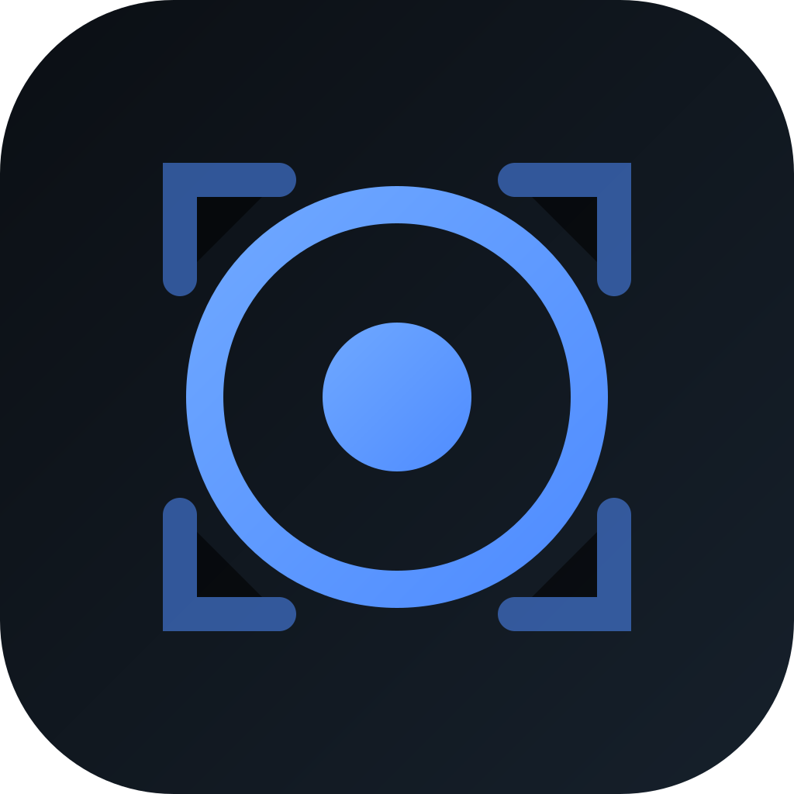

# Focus — App-Mode Browser Launcher

<p align="center">
  
</p>

<p align="center">
  Modern tarayıcıları (Brave / Chrome / Edge) <b>app modunda</b> — adres çubuğu, sekme ve
  butonlar olmadan, yalnızca sayfaya odaklanmış olarak — başlatan sade bir başlatıcı.
</p>

<p align="center">
  
  
  
  <a href="https://github.com/xxx02/focus/releases/latest"></a>
</p>

---

Küçük ekranlı cihazlarda dikkat dağıtan tarayıcı arayüzünü kaldırıp tek sayfaya odaklanmayı sağlar.

- 🔎 **Google arama çubuğu** — arama yap veya doğrudan adres gir
- ⭐ **Yer imleri** — ekle / düzenle / sil, JSON olarak dışa & içe aktar
- 🌐 **Tarayıcı seçimi** — kurulu tarayıcılar otomatik algılanır
- 🎯 **App modu** — açılan sayfa adres çubuğu/sekme olmadan, tam odakla gelir
- 🎨 **Modern sade arayüz** — açık/koyu tema, responsive ızgara

## İndir & Kur

En güncel kurulum dosyalarını **[Releases](https://github.com/xxx02/focus/releases/latest)** sayfasından indir:

| Platform | Dosya | Kurulum |
|---|---|---|
| **Windows** | `Focus-Setup-Windows.exe` veya `Focus-Windows.zip` | `.exe`'yi çalıştır (kur), ya da zip'i açıp `focus_launcher.exe` |
| **macOS** | `Focus-macOS.dmg` | Aç, uygulamayı Applications'a sürükle. İlk açılışta sağ tık → Aç |
| **Linux** | `Focus-Linux-x86_64.tar.gz` | Aç ve `focus_launcher`'ı çalıştır (`./focus_launcher`) |
| **Android** | `Focus-Android.apk` | APK'yı indirip kur ("bilinmeyen kaynaklar"a izin gerekebilir) |

> Not: Windows ve macOS dosyaları kod imzasız olduğundan SmartScreen/Gatekeeper uyarısı çıkabilir;
> "yine de çalıştır" / sağ tık → "Aç" ile geçilir.

## "App modu" nasıl çalışır?

| Platform | Mekanizma |
|---|---|
| Windows / macOS / Linux | Seçili tarayıcı `--app=<URL>` bayrağıyla başlatılır (gerçek app penceresi) |
| Android | **Chrome Custom Tab** (minimal arayüz; `--app` Android'de yoktur) |

## Kaynaktan derleme

Gereksinim: [Flutter SDK](https://docs.flutter.dev/get-started/install) 3.x.

```bash
git clone https://github.com/xxx02/focus.git
cd focus
flutter pub get
dart run flutter_launcher_icons   # uygulama ikonlarını üret

flutter run -d linux        # Linux masaüstü
flutter run -d windows      # Windows (Windows makinede)
flutter run -d macos        # macOS (macOS makinede)
flutter run -d <android-id> # Android cihaz/emülatör
```

Kurulum çıktıları:

```bash
flutter build linux --release      # build/linux/x64/release/bundle/
flutter build windows --release    # build/windows/x64/runner/Release/
flutter build macos --release      # build/macos/Build/Products/Release/Focus.app
flutter build apk --release        # build/app/outputs/flutter-apk/app-release.apk
```

## Sürüm yayınlama (otomatik)

Bir sürüm etiketi attığında **GitHub Actions** dört platform için kurulum dosyalarını otomatik
derler ve Release'e ekler:

```bash
git tag v1.0.0
git push origin v1.0.0
```

Bkz. [`.github/workflows/release.yml`](.github/workflows/release.yml).

## Mimari

```
lib/
  main.dart                  # Giriş, tema, servislerin yüklenmesi
  models/                    # Bookmark, BrowserChoice
  services/
    browser_detector.dart    # Kurulu tarayıcıları bul (platforma göre)
    browser_launcher.dart    # app modu (masaüstü) / Custom Tab (mobil)
    bookmark_store.dart      # Yer imi CRUD + import/export (yerel JSON)
    settings_store.dart      # Seçili tarayıcı + tema tercihi
    query_resolver.dart      # Metin → URL veya Google araması
  ui/                        # home_page, settings_page, kartlar, app_scope
  theme/app_theme.dart       # Material 3 açık/koyu tema
```

## Lisans

[MIT](LICENSE) © 2026 xxx02
